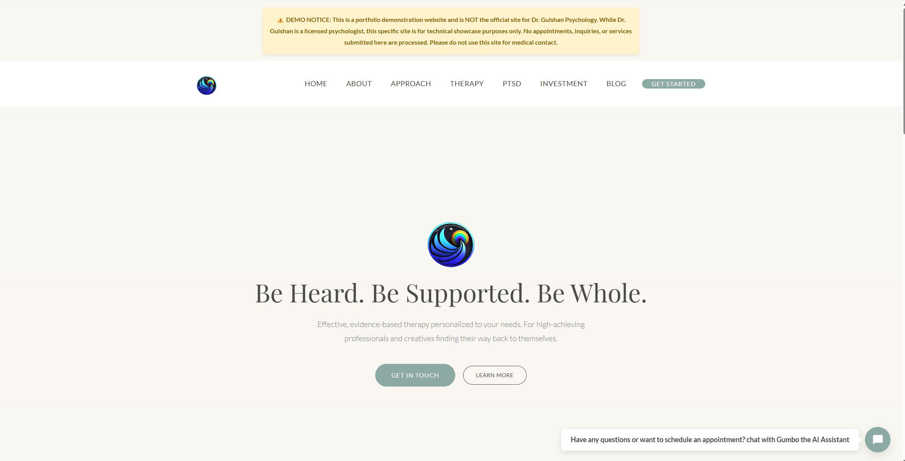
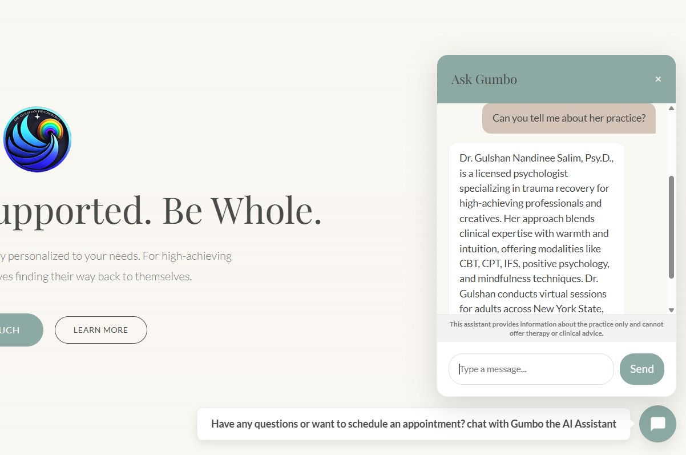
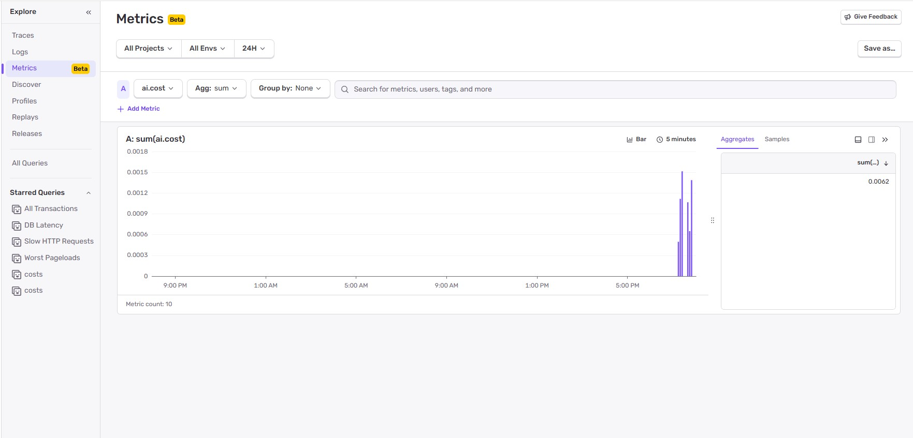
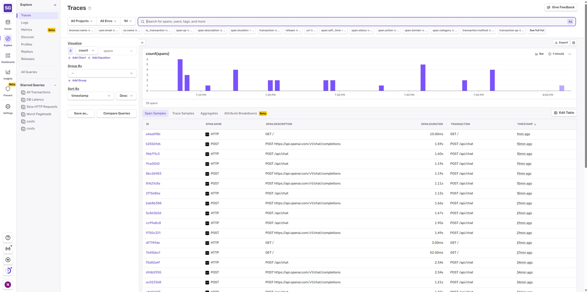

# AI-Integrated Therapy Platform: Dr. Gulshan Psychology

> **⚠️ DEMO NOTICE:** This is a **portfolio demonstration website** and is NOT the official site for Dr. Gulshan Psychology. While Dr. Gulshan is a licensed psychologist, this specific site is for technical showcase purposes only. **No appointments, inquiries, or services submitted here are processed.** Please do not use this site for medical contact.

A modern, high-performance, and context-aware professional website built for Dr. Gulshan Nandinee Salim, Psy.D. This project serves as a showcase for **AI-Augmented Development**, demonstrating how complex architectural and technical requirements can be orchestrated using modern AI tools.

##  Live Demo
**https://ai-integrated-therapy-site.onrender.com/**

##  Visual Showcase

  
  &nbsp;
  

<em>Left: The therapeutic "Wellness" landing page. Right: The custom "Gumbo" AI chat interface.</em>

##  The "Gumbo" AI Assistant
The standout feature of this platform is **Gumbo**, a custom-built, context-aware chatbot.
- **Context-Locked:** Gumbo is trained specifically on Dr. Gulshan’s practice, including her "Haunted House Therapy™" method, fees, and clinical philosophy.
- **Safety First:** Hardcoded safety guardrails prevent the AI from offering clinical advice or diagnosis, directing users toward official consultations instead.
- **Memory Management:** Features a "10-Turn Compaction" cycle where it summarizes long conversations to maintain context without exceeding token limits or losing focus.
- **Streaming UI:** Implements a character-by-character typing animation for a premium, human-like interaction feel.

##  Security & Monitoring
To ensure the safety and reliability of the AI assistant, we have implemented robust security measures:
- **Hard Input Validation:** A pre-flight check strips all XML/HTML tags from user input to prevent tag injection attacks.
- **Jailbreak Detection:** A "hard guardrail" system scans for malicious keywords (e.g., "ignore previous instructions", "act as") and blocks the request *before* it reaches the AI model.
- **Sentry Integration:** Real-time monitoring tracks:
  - **Security Events:** Immediate alerts for blocked injection attempts.
  - **Usage Metrics:** Token consumption and cost tracking for every interaction.
  - **Error Logging:** Remote capturing of server-side errors for rapid debugging.

### Observability & Metrics

#### 1. AI Financial Operations (FinOps)
*Real-time tracking of exact AI spend per session and token distribution. This allows for immediate budget alerts if costs spike.*

#### 2. End-to-End Tracing
*Distributed tracing visualizing the full lifecycle of a chat request. This isolates OpenAI API latency (purple) from internal server processing time (blue), essential for performance tuning.*

#### 3. System Health Dashboard
*A unified operational view combining our custom cost/token metrics with Sentry's default health indicators (error rates and throughput) to monitor overall application stability.*

## Tech Stack & Architecture
- **Frontend:** Vanilla HTML5, CSS3, and Bootstrap 5. Chosen for extreme speed, SEO optimization, and long-term maintainability.
- **Backend:** Node.js with Express. Acts as a secure bridge between the user and OpenAI, protecting API secrets.
- **AI Engine:** OpenAI GPT-3.5 Turbo.
- **Design System:** A custom "Wellness/Spa" aesthetic utilizing a Sage Green and Warm White palette for a therapeutic user experience.

## AI-Augmented Development Disclosure
In the spirit of transparency, **100% of the code in this repository was generated using AI agents (Gemini/GPT)**. 

My role in this project was that of the **Solutions Architect and Product Manager**:
1.  **Information Architecture:** I defined the sitemap, user flow, and content hierarchy based on the client's existing clinical needs.
2.  **Logic Design:** I architected the memory compaction logic for the chatbot and defined the safety guardrails.
3.  **Visual Direction:** I directed the UI overhaul, moving from a dark theme to a light "Be Well" aesthetic to better align with the therapeutic mission.
4.  **Integration:** I handled the orchestration of the frontend/backend bridge and ensured all technical components functioned as a cohesive platform.

##  Installation & Running Locally
See the [INSTRUCTIONS.md](./INSTRUCTIONS.md) file for a step-by-step guide on how to set up your `.env` file and start the local server.

---
**Developed by [Ahmedur Rahman/Asrahmann]**  
*Showcasing the future of rapid, high-quality web development through AI collaboration.*
